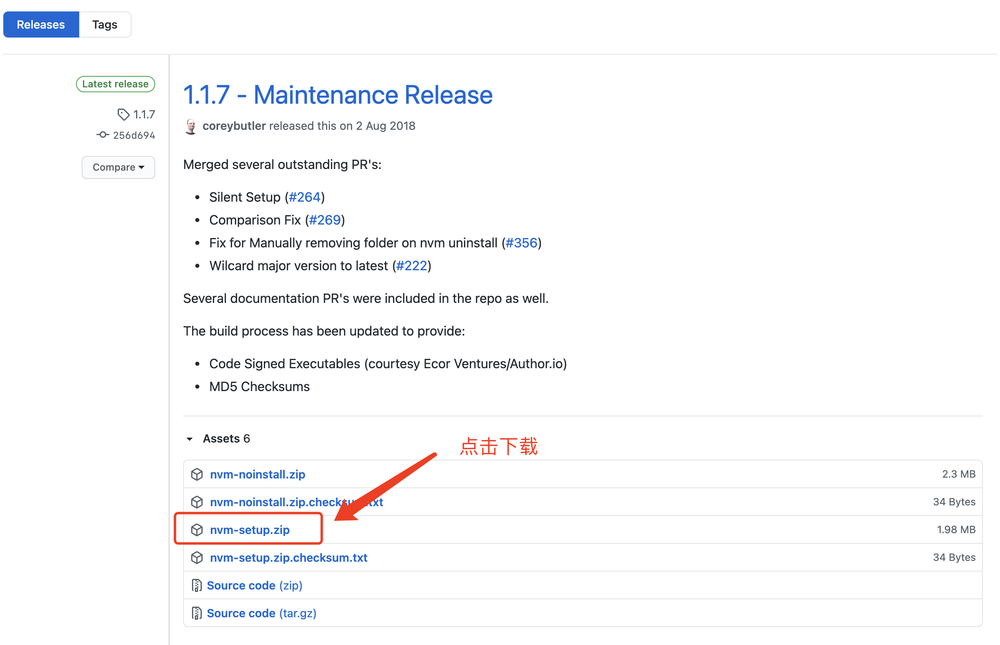

# Nodejs的安装及使用
## 认识Nodejs
Node.js 是一个基于 Chrome V8 引擎的 JavaScript 运行环境。

### Node.js安装
* ##### 官网下载
* ##### nvm

&emsp;&emsp;这里推荐第二种方式，通过nvm来管理node的版本，对于软件安装来说我们常常会选择安装最新版，但是我们在今后的开发当中，有些东西对于新版的node并不兼容，不如下篇文档中要讲的gitbook这个软件，经测试新版本并不兼容，需要用到v10.21.0版本的node，在不借助第三方工具的情况下，我们只能先卸载旧版本，再安装新版本，这样非常麻烦，nvm就很好的帮我解决了这个问题。

##### nvm工具安装
###### Windows版安装：[下载地址](https://github.com/coreybutler/nvm-windows/releases)


下载好后解压直接双击安装，安装完成后在`CMD`命令窗口输入`nvm -v`，输出如下版本号即证明安装成
```
Running version 1.1.7
```
###### Mac版安装：
```
# 1.先安装brew（不会的自行百度），在利用brew安装nvm
brew install nvm
# 2.添加环境变量，进入到当前用户的更目录，按shift+command+.显示隐藏文件，找到.bash_profile和.zshrc（新版mac系统用了zsh的shell工具，所以.zshrc也要配置下），添加如下配置
source $(brew --prefix nvm)/nvm.sh
# 3.运行下面命令，让配置生效
source ~/.bash_profile 或者 source ~/.bash_profile
```

##### nvm工具安装及管理node
```
# 1.通过nvm查看当前可安装的node版本
nvm list available
# 2.安装node
nvm install 版本号
# 3.设置当前要使用的node版本
nvm use 版本号
# 4.设置默认node版本
nvm alias default 版本号
```