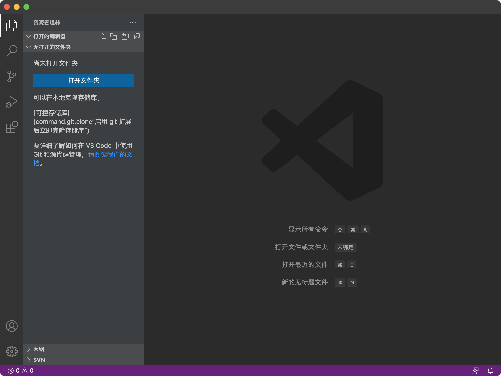
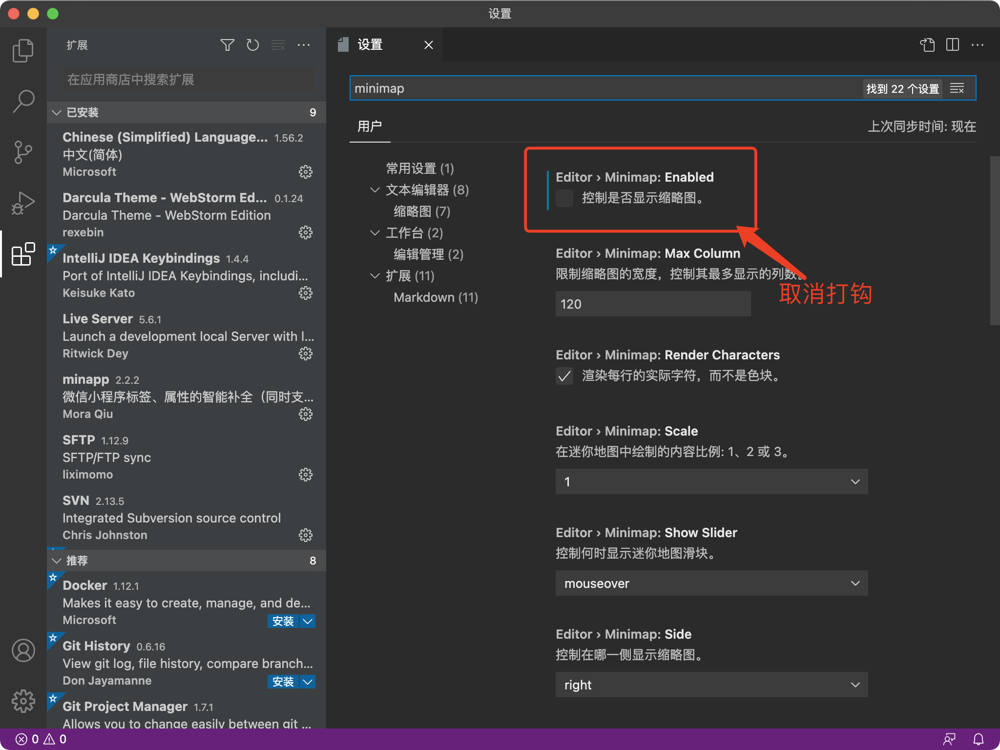
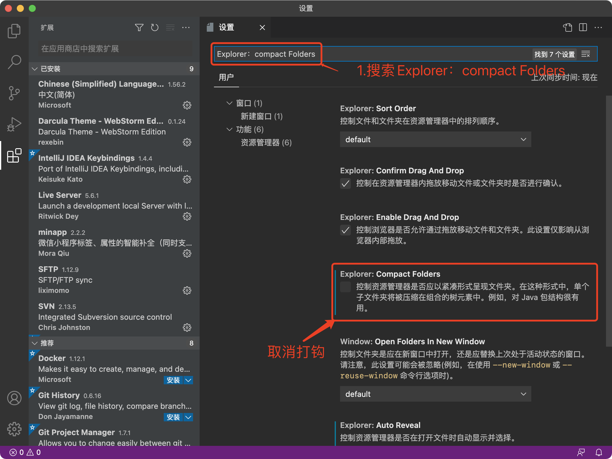

# VSCODE的安装及使用
## 认识VSCode
Visual Studio Code (简称 VS Code / VSC) 是一款免费开源的现代化轻量级代码编辑器，支持几乎所有主流的开发语言的语法高亮、智能代码补全、自定义快捷键、括号匹配和颜色区分、代码片段、代码对比 Diff、GIT命令 等特性，支持插件扩展，并针对网页开发和云端应用开发做了优化。

俗话说工欲善其事必先利其器，一款便捷好用的编辑器对于开发人员来讲十分重要，这里隆重推荐这款有微软开发的Visual Studio Code，不仅好用，最最最关键，免费，免费，免费，重要的说三遍。
我们可以访问[VSCode官网](https://code.visualstudio.com)下载最新版的VSCODE。

安装完成效果图如下：

### VSCode插件安装
* 中文插件

你们刚安装好可能和我的有些许不同，我的是中文的，你们是英文的，那么我们要怎么让他显示中文呢，请看下图：

* Sublime快捷键扩展

在插件中心搜索Sublime，安装插件即可，sublime快捷键有一个非常好用的，多行编辑，大家可以下载下来自行体会

### VSCode简单配置
* 关闭右侧预览

VSCode默认开启预览功能，如果屏幕比较小会很占用空间，所以正常会将它关闭

* 关闭空文件夹折叠

VSCode默认开启空包折叠，简单来就是空的文件夹左侧目录导航就会只显示一个路径，不知道大家感觉如何，我个人是感觉很难受，所以我正常会把这个关闭

* 单击新文件会覆盖旧文件窗口

VSCode安装好后当我们想打开多个文件的时候会出现一个问题，单击新的文件，新的文件会在当前窗口打开，之前打开的文件就被关闭了，这样很不友好，所以我会将这个功能关闭

